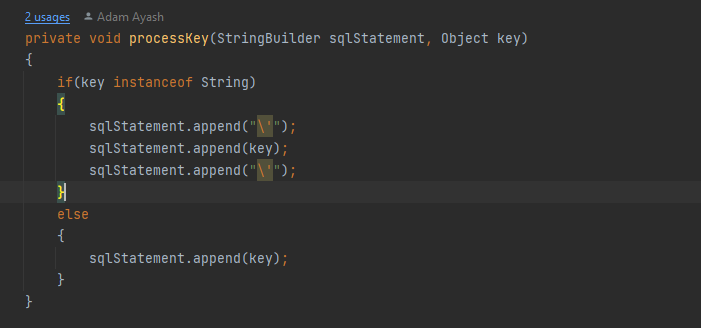

ТЕХНИЧЕСКИ УНИВЕРСИТЕТ – ВАРНА

Факултет по изчислителна техника и автоматизация

Катедра „Софтуерни и интернет технологии“

СЕМЕСТРИАЛНА ДОМАШНА РАБОТА

по дисциплината „ООП Част 2”

на тема: „Куриерска фирма ”

Вариант VII

| **Изготвил:**  Адам Аяш        |  **Изготвил:**  Павел Бойчев    |
|--------------------------------|---------------------------------|
| **Специалност**: СИТ           |  **Специалност**: СИТ           |
| **Група: 3**                   |  **Група: 3**                   |
| **Факултетен номер:** 21621553 |  **Факултетен номер:** 21621538 |

Съдържание

1.  Анализ на проблема:
    1.  Функционални изисквания
    2.  Проучване и избор на технологии за реализацията съвместими с Java и JavaFX
    3.  Структура на проекта
    4.  Дефиниция на модулите на системата
2.  Проектиране на системата:
    1.  Проектиране на отделните модули (примерни: база данни, GUI, бизнес логика)
    2.  UML – Use Case, Class Diagram, Sequence diagram и други
    3.  Концептуален модел на базата от данни (ER диаграма (модел на Чен))
3.  Реализация на системата:
    1.  Реализация на базата от данни (PostGres, Oracle, MS SQL, My SQL) – Релационна схема описание на таблиците
    2.  Реализация на слоя за работа с базата данни (DAO, JPA (Hibernate))
    3.  Реализация на бизнеслогика и графичен интерфейс – Java, JavaFX
    4.  Реализация на модул за регистриране на събития в системата – log4J
4.  Тестови резултати:
    1.  JUnit tests

Условие на проекта

Да се разработи информационна система, предоставяща услуга за изпращане и

получаване на пратки по куриер. Програмата съхранява и обработва данни за

създадени пратки, обработени от куриер и доставени до адрес.

# Системата поддържа три вида потребители:

-   администратор
-   куриери
-   клиенти

# Операции за работа с потребители:

-   създаване на куриерска фирма(и) от администратор(име, офиси в градове и др.
-   създаване на куриер към фирма от администратор
-   регистриране на клиенти на куриерската фирма от куриер

# Системата поддържа операции за работа със изпращане и получаване на пратки:

-   регистриране на пратка в офис на фирмата. Различните категории пратки (плик, колет, голям пакет, товар) имат различни цени;
-   транзит на пратката до местоназначението(извършва се автоматично от системата на базата на времезаделяща техника!)
-   статус на получаването – получено, неполучена, отказана

# Системата поддържа Справки по произволен период за:

-   пратки и тяхното състояние
-   възможност за проследяване на статуса на дадена пратка;
-   статистика на куриерската фирма
-   работа на куриерите;
-   статистика за клиентите на куриерските фирми.

# Системата поддържа Известия за:

-   неполучени пратки;
-   отказани пратки

Анализ на проблема

-   Функционални изисквания
-   Създаване, редактиране и изтриване на различните категории потребители, пратки, компании и офиси
-   Справки за произволен период за пратки и тяхното състояние, работа на куриерите, статистика на куриерската фирма, статистика за клиентите на куриерските фирми, възможност за проследяване на статуса на дадена пратка, пратки и тяхното състояние
-   Изобразяване на данните в графичен интерфейс
-   Известия за получени и отказани пратки
-   Проверка за коректност при попълване на данни в полетата
-   Проучване и избор на технологии за реализацията съвместими с Java и JavaFX
    -   За реализация на слоя за бази от данни използваме единствено JDBC драйвер, съвместим с Microsoft SQL Server. Избран е точно той понеже имаме известен опит с него и екипът ни смята, че има доста повече преимущества отколкото другите сървъри. Няколко такива преимущества за удобствата на синтаксиса, модерната среда SQL Management Studio, която доста улеснява процеса на разработка, друго преимущество е вграденият SQL Agent, който предлага възможност за автоматизация на някои процеси.
    -   За запис на събития в системата използваме log4j, понеже предлага огромно удобство и не се нуждае от почти никакво конфигуриране,
    -   Следва стандарта на apache за логване на събития и има различни начини на употреба, като например : запис във файл в база данни, дори и по поща.
    -   Използваме open-source библиотека controlsFX единствено и само заради улеснението което предоставя при конструирането на известия. Известията се конструират с помощта на шаблона builder
    -   Password4j използваме за криптиране на паролите в базата данни, отново библиотеката е open-source и предоставя няколко различни варианта за криптиране на пароли, като имаме и варианти за добавяне на salt и pepper които са вградени в самата функция за криптиране. За полезрението на този конкретен проект сме установили, че ще пазим паролите в същата база от данни в която пазим и другите данни, но в реален проект е добра практика такъв тип данни като пароли и потребителски имена да се пазят в отделна база.
    -   Структура на проекта
        -   Избраната архитектура за проекта е двуслойна **фигура 1**, тя е перфектна за такъв тип проект, понеже предоставя гъвкавост при смяна на източника на данни, ако по някаква причина решим да сменим източника на облак или на текстов файл, няма да имаме проблем понеже слоят, който се грижи за визуализация комуникира с така на речените Data classes. Тоест слоят за визуализация няма представа какъв е източникът на данни. Като в нашият случай ние използваме тези класове само когато имаме взаимодействие с повече от една таблица

            **Фигура 1:**

-   За презентационният слой използваме MVC(Model View Architecture), понеже Java FX така или иначе вече е насочен в тази посока, но нашата адаптация на този подход взима и вдъхновение и от Document-View архитектурата.
-   Дефиниция на модулите на системата
    -   Database – съдържа механизмите за работа с бази данни, конструирането на заявки и връзка към базата.
    -   Controllers – съдържа всички контролери
    -   Domain Objects – съдържа всички бизнес обекти дискови структури

# Проектиране на системата

## Use-case диаграма на системата:

## Базови класове за работа с бази от данни

## Диаграма на бизнес класовете

## Диаграма на базови класове свързани с презентационния слой

## Диаграма на базите от данни

# Реализация на системата

-   Описание на основните таблици
    -   Counters – съдържа информация за уникалните идентификатори на различните таблици в базата – текущата позиция на идентификатора, с колко се увеличава той име на колоната на идентификатора и др.
    -   Users – съдържа информация за потребителите в система като потребителски имена, хешираните пароли и тип потребител (admin, client, employee)
    -   Cities – номенклатура за градове
    -   Companies – съдържа данни за съответните компании
    -   Offices - съдържа информация за офисите към съответните компании
    -   Orders - съдържа информация за поръчките
    -   Clients - съдържа информация за клиентите
    -   Employees - съдържа информация за работниците
    -   Notification - в тази таблица постъпват нотификации за отхвърлени и доставени пратки

При реализацията на базата данни е избран подход при който не оставяме сървърът самостоятелно да генерира уникални идентификатори, а сами поемаме отговорност за тяхното менажиране, за целта на този проект това не е необходимо но при по-голям и сериозен проект това вече става доста по-полезно, в нашият случай identity колона би ни свършила чудесна работа, но за целта на упражнението екипът ни реши да експериментира с този архитектурен шаблон. Има и други начини като GUID, което представлява текстов идентификатор, минуса при него е че заема доста място и индексите ще трябва да се пренареждат на диска при всяка актуализация което в големи проекти може да бъде проблем. Друг вариант би бил тригер, но не е препоръчително понеже тригерите са доста бавни.

Самата таблица Counters само държи информация за позицията на текущият идентификатор, когато искаме да вмъкнем запис в базата, четем от нея след това актуализираме идентификатора и го записваме обратно в таблицата. Самото актуализиране може да става през кода от функция - generateUniqueIdentifier или чрез съхранена процедура - SP_GENERATE_NEXT_UNIQUE_ID

## Реализация на слоя за работа с базата данни

-   Връзка с базата данни – връзката с базата данни е реализирана с помощта на Singleton клас DatabaseConnectionPool, както името на класа подсказва класа представлява pool(множество сесии) към базата. Класът е singleton или позволява само една инстанция към него за да няма ненужна алокация на сесии, тъй като това е скъпа операция, също помага за консистентност в работата с бази от данни от гледна точка на работа с нишки. При първоначалният анализ на задачата установихме, че DatabaseConnectionPool класът ще е полезен най-много ако в даден момент решим да изпозваме повече от една нишки. Към момента в началото на живота на приложението то започва с 10 активни сесии към базата данни.

Този подход дава още едно преимущество и то е че при невалидна сесия или при някакъв проблем класът ще замени невалидната сесия с нова и няма да прекрати живота на приложението. Като принципа на работа е следният когато ще се извършва заявка до базата данни тя ще вземе сесия от колекцията със свободни сесии и ще я премести в колекцията със сесия които в момента са във употреба след като операцията завърши сесията се връща обратно в колекцията със свободни сесии, като при всяко поискване на сесия тя първо се проверява дали е валидна/активна.

-   Слой за работа с бази данни – Слоят за работа с бази от данни в реализацията на проекта не използва ORM(Object Relational Mapping) или друга допълнителна библиотека. Причината за това решение е че екипът ни не желае да има абстракция от SQL заявките, които този тип библиотеки предлагат, както и процесът на debugging може да бъде доста по труден в сръвнение с нашия подход. Работата с транзакции също е доста ограничена при работа са такива инструменти. За целта сме реализирали няколко класа които предоставят подобна функционалност, но не отнемат абстракцията от SQL заявките.
    -   Класът Database Object – предоставя функционалност за работа с сесии, отваряне и затваряне на транзакции

-   За mapping между дискови структури POJO(Plain Old Java Object) и таблици от базата данни използваме класът Column и DataMap класът Column има за цел да пази информация за колона от базата данни – името на колоната от базата и полето което ще съхранява данната, докато DataMap съдържа колекция от колони(Column), името на таблицата и референция към POJO обектът. Класовете са реализирани изцяло с помощта на JAVA Reflection API-a.

-   SQL заявки – заявките в система се генерират от помощен клас SQLQuery, който има за цел да постави абстракция върху заявките и да предотврати забити стойности в кода. Класът е доста просто устроен той прима 2 параметъра името на таблицата, и тип заключване(SQL Lock) – за това по-късно. Само с тези 2 параметъра методът generateSQLStatement ще генерира заявка към съответната таблица. За допълнителни филтри от тип where, класът съдържа лист от обекти от тип SQLCriteria, които сами по себе си определят една where клауза. SQLCriteria е generic клас, който съдържа 3 атрибута – Име на колона, тип на търсене(ComparisonType) и самата стойност по която ще се търси.

Начин на употреба – заявка без критерии отговаря на (SELECT \* FROM\<TBALE_NAME\> WITH(NOLOCK))

Начин на употреба – заявка с критерии отговаря на (SELECT \* FROM \<TBALE_NAME\> WITH(NOLOCK)) WHERE COLUMN_NAME = VALUE)

-   BaseTable класът отговаря за CRUD(Create, Read, Update Delete) операциите в системата, всеки табличен клас в системата наследява BaseTable и в метода laodDataMap описва колоните на таблицата

Класът освен тези базови операции поддържа и някои доста полезни функции като методът за синхронизация на колекция от записи. Такъв метод е необходим когато бизнес логиката налага два записа от различни, но свързани под някакъв constraint най-често foreign key да бъдат обработени едновременно. В нашата система това се налага при вмъкването на офиси към дадена фирма.

Това е нужно понеже при актуализация на дадена фирма ние може да вмъкнем нов офис, да актуализираме вече съществуващ или да изтрием такъв.

Друг тънък момент с операциите с бази данни е дилемата за така наречената конкурентност(concurrency) или възможността повече от един потребители да обработват един и същи запис. За решаването на този тип проблем има два подхода оптимистичен и песимистичен .

С други думи единият вариант е при дадена операция да заключим записа, като отворим транзакция и дадем hint на SQL-ла, докато потребителят не приключи работа със записа, сами се сещате кой от двата е този подход. Проблемът с него е ,че не се знае колко време ще се забави потребителят а и в зависимост от типа запис заключването може да ескалира и да доведе до нежелано поведение, едно от решенията е да добавим брояч който след определено време да пуска записа, но и този подход има съответните проблеми. В нашият случай бизнес обектите (Domain Object) или дискови структури, ако ще подлежат на актуализация задължително трябва да наследяват класът UpdatableDomainObject. Този клас предоставя на наследника поле от тип цяло число, което има за цел да отразява версията на реда.

Идеята на този атрибут е да сравнява текущо актуализирания запис и прясно изчетен запис от базата данни и да сравни техните броячи, в случай че те се различават, това значи е някои преди нас е актуализирал записа и той вече не е актуален и ще трябва да rollback-нем.

Друга особеност на базовият табличен клас е методът FormSQLPrimaryKey ,които може да генерира заявка по уникален идентификатор автоматично без нуждата от обект за заявки(SQLQuery) това става благодарение на custom-анотацията @PrimayKey, която маркира съответната колона от дисковата структуа, съответно методът обхожда полетата на бизнес класът и намира съответното поле

Съответно операциите за insert, update, delete използват тази функция в логиката си.

Функцията е доста полезна в случай, че записа е различен първичен ключ от цяло число. В системата до момента няма такива таблици, но ситуацията е предвидена.

При вмъкването записа се прочита и курсора се премества в позиция за вмъкване данните от буфера се преместват в resultset-а, както там се генерира новият идентификатор на записа и се записва.

# Реализация на бизнеслогика и графичен интерфейс

Графичният интерфейс в системата е реализиран с помощта на MVC(Model View Controller) архитекрурата. 

Идеята на този подход е разделянето на презентационният слой на три компонента

-   View – това е графичният интерфейс, който потребителят вижда
    -   Model – данните които се визуализират
    -   Controller – отговорен за логиката на екрана – зареждане, валидация тн.

Нека да започнем с най-важните елементи от презентационният слой(VIEW), които предоставя Java FX, a именно scene(сцена) и stage(постановка). Постановката представлява мястото където се развива действието за нас това е активен прозорец, а сцената това което се визуализира върху нея.

Отделно на всяка сцена могат да се поставят елементи. В нашата система сме използвали най-често, текстови полета, комбо-боксове и етикети.

За инициализирането на постановки и сцени динамично сме разработили два класа, които ги управляват. Класът StageManager и SceneManager. StageManager e доста просто устроен клас, той изисква път до fxml файлът който съдържа информация за сцената, име на прозореца, контролер, и извикващият го клас, създава прозорец и му назначава сцена.

SceneManager от своя страна може да сменя сцената на вече съществуващ екран, като може да презареди сцената и да не запазва текущото и състояние или да я презареди напълно.

В основата на работата на този клас седи Map който държи инстанция на заредените сцени по подаден ключ пътят към сцената, ако тя не съществува той ще я създаде, ако тя съществува той ще я зареди от мапа.

При работата с JavaFX има няколко подхода на работа, единият е да назначим контролер в fxml документа и при инициализация на сцената, контролерът да се създаде динамично, а другият е да създадем контролера преди да инициализираме сцената по този начин можем да заредим нужните данни в контролера без да има нужда да разчитаме на външен framework като SpringBoot.

Самите контролери се разделят на няколко базови класове:

BaseController – абстрактен клас който всички контролери наследяват и пренаписват методът initializeController, класът също съдържа референция към SceneManager, в случай че от един екран се налага да се прехвърлим на друг, както при екран за логване на потребители в система след успешно влизане.

DialogController – представлява отделен прозорец за въвеждане, преглед, актуализиране на данни. Той има няколко важни метода, които се извикват в пренаписания initializeController. Това са методите setControls, loadData и setDataToControls.

Първият метод определя първоначалното състояние на контролите на екрана,

loadData зарежда при необходимост допълнителни данни, които може да са нужни на екрана, и последният метод инициализира началните стойности върху екрана.

Отделно DialogController има логика за бутоните за запис и затваряне на екрана.

За визуализация на записи в система се използва контролата TableView, която представлява списъчни данни. За целта ние сме разширили тази контрола чрез композиция и сме улеснили начина и на използване. Generic класът SmartTableViewController предоставя лесно конфигуриране на списъчни данни на екрана, той прима два generic параметъра типа на дисковата структура и разширеният тип за визуализация или този клас ни предоставя възможност да използваме виртуални таблици VIEWS. Класут има няколко метода като абтсракният метод InitTableViewColumns чрез който описваме колоните които ще се визуализират на екрана

Друг важен метод е refreshTableView, който описва как ще се зареждат данните в контролата

Съответно операциите в система стават чрез няколко бутона от контекстно меню

Всеки наследник на класът описва действията на тези бутони в метода setContextMenu

# Реализация на модул за регистриране на събития в системата

Отразяването на събития в системата се извършва с помощта на log4j. Тя се конфигурира с помощта на xml файл и е изключително удобна за използване. В нашият проект отразяваме най-вече грешки в системата тъй като отразяването на този тип събития помага изключително много в процеса на търсене на проблем. Нивото на грешка error е това което използваме най-много. Всички базови класове описват нива на грешка в системата без изключение. В нашата реализация log4j създава директория на C:/ диска с името на проекта и вътре се съхраняват самите log файлове.

# Резултати от тестове

